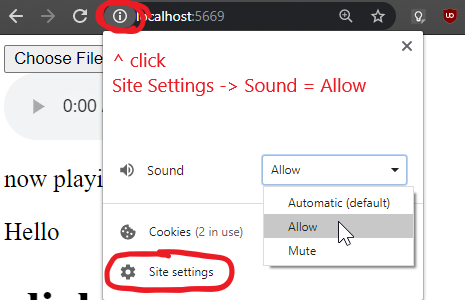

based on this  
https://github.com/project-slippi/slp-parser-js/blob/master/scripts/realtimeFileReads.js  

### Ensuring everything works  
1. "Slippi Recording" gecko code must be enabled in dolphin  
2. You may need to uncomment the slippi_output_dir in the config.js and point it to wherever your slippi files output  
(defaults to Documents/Slippi)
3. to allow music to auto play before you've clicked on the page:  
  

### How to modify songs  
songs are stored in stage folders inside the sounds/ direcotry  
add your own audio files (mp3 or ogg) to your desired stage folder  
whenever a game starts on that stage, a random song from that folder will play  
I've included royalty-free versions which can be toggled in the web interface  
You can add stages other than the legal stages by creating a new directories and modifiying the 'dir' field in config.js for that stage  

### Running from source  
requirements: nodejs, npm  
clone this repository, cd to directory then  
```
npm install
node server.js
```

open ```http://localhost:5669/``` in a browser.  
then start up slippi and it'll play songs when games start.  
slippi recordings must be ON.  